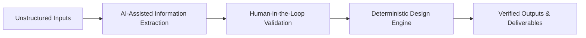

# Why Deterministic Code Must Remain the Authority in AI-Assisted Engineering

By Matthew Lohens (Electrical and Machine Learning Engineer)

## Executive Summary

Artificial intelligence—particularly large language models—has demonstrated impressive capabilities in pattern recognition, summarization, and information extraction. Many engineering organizations are now exploring how these tools might fit into their design workflows.

This exploration has generated real confusion about where AI should and should not operate within engineering processes. This essay argues for a clear architectural boundary: AI should assist with information gathering and interpretation, while deterministic, auditable code must remain the authoritative engine for engineering design.

The examples here draw primarily from electrical engineering, but the underlying patterns—repetitive deterministic calculations, verification requirements, and professional accountability—appear across all regulated engineering disciplines.

This distinction is not philosophical. It is rooted in verification requirements, professional responsibility, regulatory expectations, and the practical realities of how engineering work is reviewed, approved, and defended.

## The Core Problem: Engineering Is Repetitive, Accountable, and Reviewable

After years of performing engineering designs and reviewing the work of others, certain patterns become impossible to ignore.

Much of day-to-day engineering design consists of repeated, structured processes. For each design element, engineers perform deterministic calculations—whether determining electrical load and conductor sizing, mechanical capacity and stress limits, thermal margins, or structural demand and resistance—and then repeat those same verification steps across larger assemblies and systems.

In electrical engineering, for example, this may involve calculating full-load current, applying code-based demand or derating factors, sizing conductors based on installation conditions, checking voltage drop, and verifying equipment ratings. Similar repetitive patterns exist in other disciplines, even when the specific equations differ.

These steps are not creative acts. They are deterministic transformations applied consistently across projects. They are critical to get right, but they are also time-consuming, repetitive, and prone to error when performed manually.

From an engineering standpoint, this raises a simple question: why are humans repeatedly performing functions that could be encoded once and reused indefinitely?

This is not a criticism of engineers. It is an observation about process design.

## The Mismatch Between Engineering Authority and AI Systems

Engineering is a discipline defined by accountability. In regulated engineering work, calculations must be verifiable, assumptions must be explicit, results must be repeatable, errors must be traceable, and responsibility must be assignable.

Large language models, by contrast, are non-deterministic, opaque in their internal reasoning, trained to generate plausible outputs rather than defensible ones, unable to guarantee identical results for identical inputs, and difficult to audit in ways that satisfy engineering review standards.

The problem is not that LLMs are ineffective. The problem is that they are not designed to serve as authorities in systems where verification and accountability are non-negotiable.

## Where AI Fits—and Where It Does Not

AI already provides meaningful value in engineering workflows, and denying that value is counterproductive.

I am comfortable using AI for drafting and refining written communication, helping articulate ideas that are already my own, learning or refreshing unfamiliar technical domains, searching across large bodies of information efficiently, producing initial drafts that a human then reviews, and gathering information from unstructured sources as a first pass.

In all of these cases, AI assists thinking. It does not replace authority.

Where I am not comfortable is allowing AI systems to perform engineering design judgments. Engineering decisions often depend on context, conservative assumptions, situational nuance, and an understanding of downstream consequences. AI systems can make mathematical errors, miss constraints, or apply rules without understanding why those rules exist.

AI can be a powerful accelerator—but it must not be the final decision-maker.

## Deterministic Code as the Engineering Backbone

Deterministic software systems map naturally onto engineering requirements.

Given the same inputs, deterministic code produces the same outputs. Every transformation is explicit. Assumptions can be encoded. Calculations can be unit-tested. Outputs can be regression-tested. Logic can be reviewed line by line.

In practice, deterministic code behaves like an engineer who has infinite patience, perfect memory, and never skips a step.

Once written and verified, such systems reduce repetitive manual effort, improve consistency across projects, catch errors earlier, and scale engineering capacity without scaling risk.

Deterministic systems do not eliminate engineering judgment—they preserve it by removing unnecessary repetition.

## Verification Is the Real Bottleneck

When reviewing engineering work—whether my own or someone else’s—trust is built through process visibility.

If I review an analysis or design calculation, I want to know what tool was used, how the calculations were performed, what assumptions were made, and whether the inputs are correct. I may spot-check results using my own trusted tools. Over time, as I consistently see sound process and correct outcomes from the same person or system, review becomes more efficient.

This approach works—but it is slow.

If a deterministic design engine has been written, tested, and validated, reviewers can shift their attention away from re-performing known calculations and toward higher-value questions: Are the inputs correct? Are the assumptions appropriate? Are there risks we are missing? Is the design optimized?

This represents a qualitative improvement in engineering review, not merely a speed increase.

## A Better Architecture: AI at the Edges, Determinism at the Core

The most effective use of AI in engineering is not as a designer, but as an interface layer.

A robust architecture looks like this. First, AI-assisted information extraction: unstructured documents such as drawings, specifications, reports, and emails are parsed into candidate structured inputs. Second, human-in-the-loop validation: engineers review and approve inputs, making assumptions explicit. Third, a deterministic design engine: structured system representations—often graph-based—are processed using verified code that performs calculations and checks. Fourth, verified outputs: results feed directly into reports, tables, and design deliverables.

Although the specific inputs and calculations differ by discipline, this architectural pattern applies broadly across engineering domains.

In this model, AI accelerates information gathering, humans retain judgment, and code retains authority.

This is not a compromise. It is an optimization.

## Conceptual Architecture

The following diagram illustrates the intended role separation between AI systems, deterministic design logic, and human judgment in an AI-assisted engineering workflow.

AI assists with information gathering at the edges of the workflow, while deterministic, auditable systems remain the authoritative core for engineering decisions.

## Automation Is Not a Threat to Engineers

A common concern around automation is job displacement. This framing misses the historical lesson.

Engineers did not become obsolete when spreadsheets replaced hand calculations. Automation removed tedious arithmetic and data entry, allowing engineers to focus on higher-level thinking.

The same opportunity exists today.

Manually checking capacities, limits, margins, and compliance is important—but few engineers would argue that repeatedly performing these checks represents the highest use of their skills or purpose.

Automation allows human effort to shift upward: toward system-level thinking, toward risk identification, toward optimization, toward communication and coordination, toward creative problem solving.

Automation does not eliminate the human role—it clarifies it.

## Conclusion

The future of engineering automation—across disciplines—is not black-box intelligence.

It is deterministic, transparent, structured, and human-supervised.

AI is a powerful accelerator, but engineering authority must remain with systems that can be verified, tested, and defended.

In engineering, speed without verification is not progress. Deterministic systems are not a limitation on AI—they are what make its use responsible.
